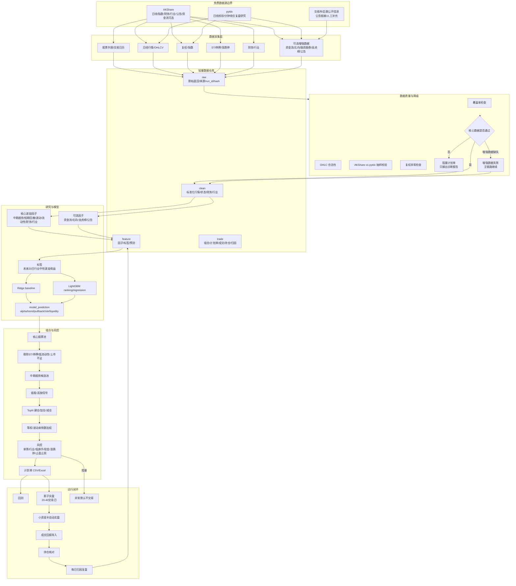
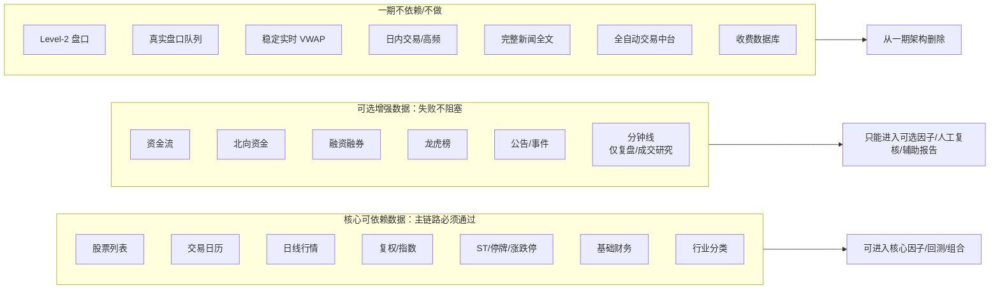
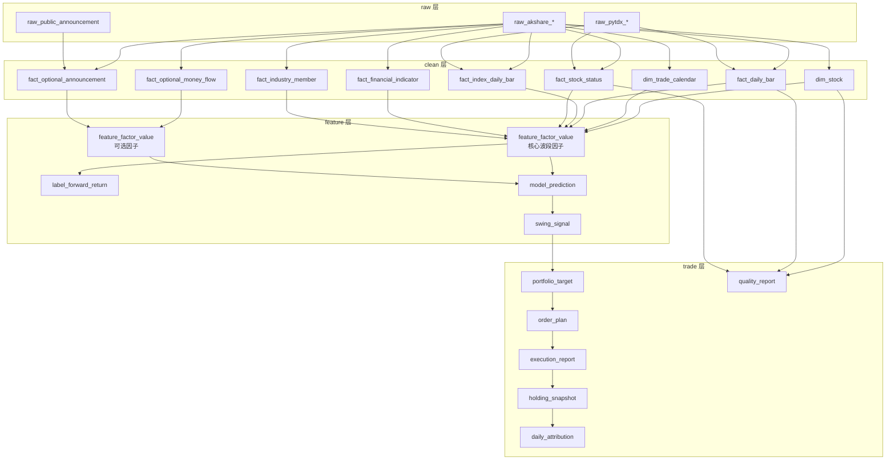
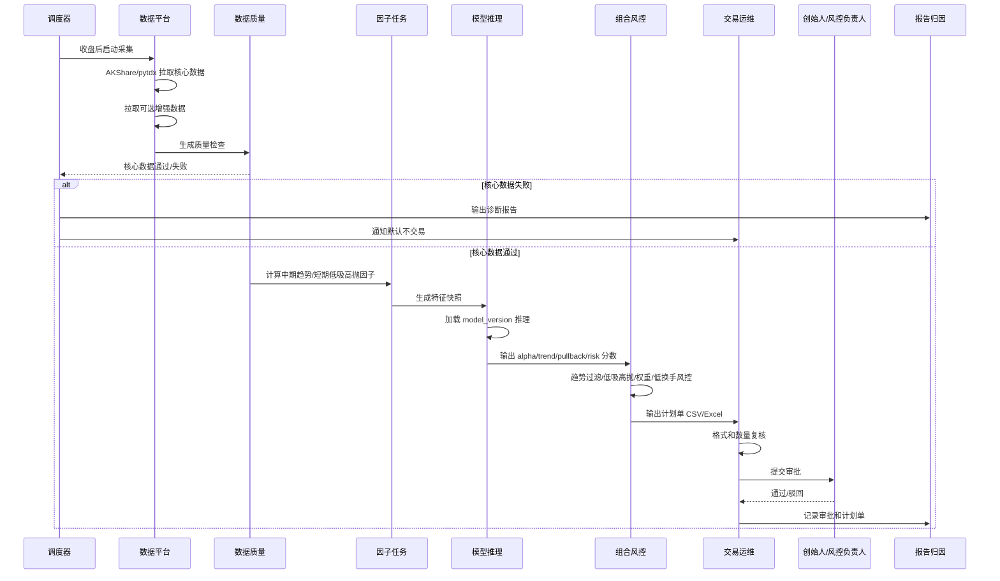
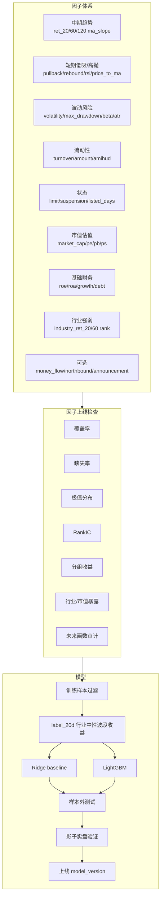
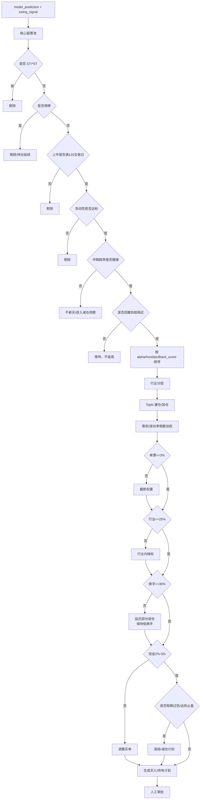
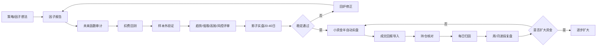
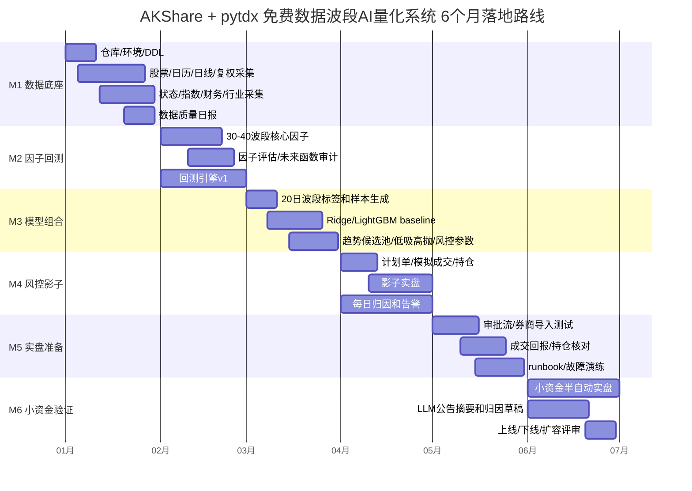
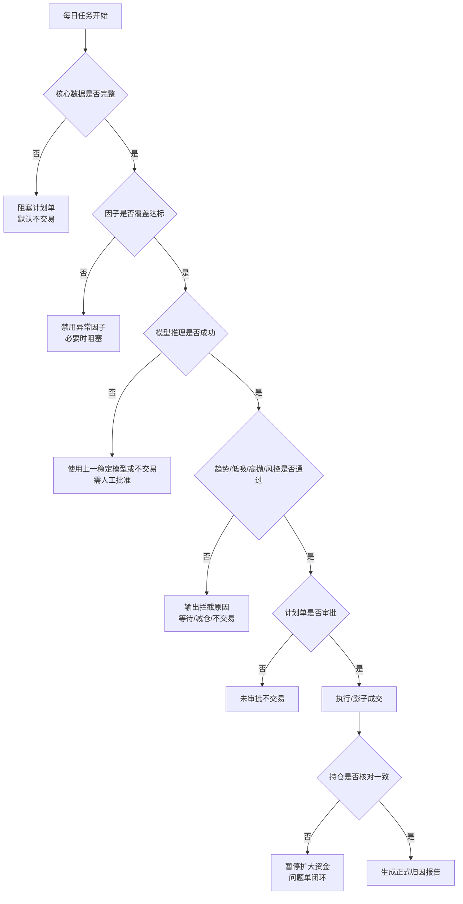

# 量化系统可视化架构图

本文档对应《AI量化系统架构_AKShare_pytdx_免费数据最终落地版.md》，用于给团队、工程师、研究员和交易运维快速对齐系统全貌。

---

## 1. 总体架构图

---

## 2. 数据可得性分层图

---

## 3. 数据仓库血缘图

---

## 4. 每日收盘后生产流程

---

## 5. 因子和模型流程

---

## 6. 组合和风控流程

---

## 7. 回测和实盘闭环

---

## 8. 6 个月路线图

---

## 9. 异常处理图

